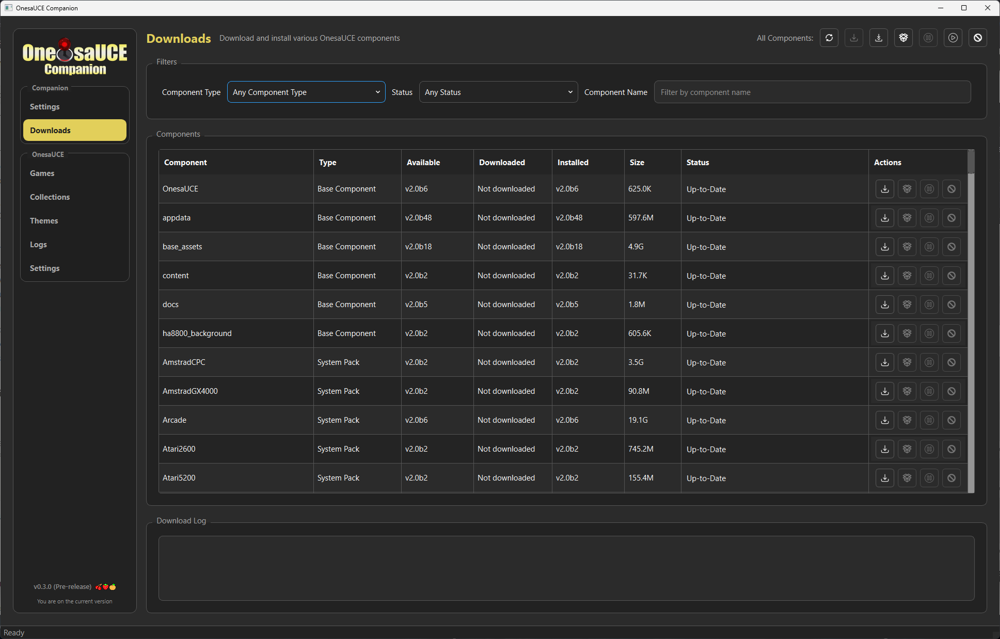
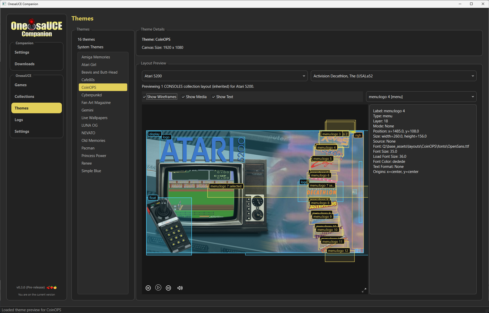

# Navigation Menu

## Companion

### Settings

**OnesaUCE Target Folder**
OnesaUCE can be installed one of the following ways
-  To a folder on a hard drive in your PC for backups or browsing media
-  To a blank NTFS formatted USB drive to use on your AtGames Legends device
-  To your existing OnesaUCE 2.0 USB drive, for performing updates or adding additional components

Note:   OnesaUCE 1.x based drives are not supported.   There is no clean upgrade path from 1.x to 2.0, so your best option is to wipe and reinstall, or use a different drive if you want to keep your original 1.x

**BitLCD Target Folder**

The BitLCD is a separate accessory for the AtGames Legends Ultimate series of products allowing the user to display marquee images based on what game is currently selected in OnesaUCE.    It uses a removable flash drive for the storage of BitLCD marquee images.    You can use OnesaUCE Companion to manage the image sets installed to the drive.

BitLCD Marquee components can be installed one of the following ways
-  To a folder on a hard drive in your PC for backups or browsing marquee art.
-  To a blank FAT32 formatted USB drive, for use in your BitLCD device.
-  To an existing BitLCD USB drive for adding or updating Marquee packs.

Note:   For marquees to be seen by the BitLCD device, they need to be installed somewhere within the bitlcd/thirdparty folder.   It's recommended to create a bitlcd/thirdparty/onesauce folder and use that as your target folder.    Each marquee pack will install to it's own subfolder within the target folder.   

The OnesaUCE and BitLCD Target Folders must reside on, or be plugged into your PC.    Installing to network drives has not been tested.    Companion does not connect remotely to any AtGames legends devices.

**Archive.org Credentials**

OnesauCE downloads are hosted by the Internet Archive.    Because these are larger downloads, it does require users to be authenticated in order to access the downloads.     You can specify your email and password.

**Downloads**

All downloads are installed to the location specified by your Target Folder and/or BitLCD Folder.    Companion needs to download the files before they are installed, so this section is where you will specify a downloads folder.   It's not recommended that you use your OnesaUCE drive for this storage, but it is possible.

You can also specify a retention policy for your downloads.    Your options are:

* Keep the latest version of each downloaded component
* Delete after every install (for minimal space usage)
* Keep zips up to a number of days
* Keep zips up to a max amount of space in GB

**Download Behavior**

* **Parallel downloads** — maximum number of concurrent downloads.
* **Auto-resume downloads on start** — when checked, any pending downloads from a previous session resume automatically when Companion launches.
* **Auto-install components after download** — when checked, a component installs automatically once its download completes.   Otherwise it remains in the **Ready for Install** state until you trigger Install manually.

**Themes Preview**

* **Enable Themes Preview** — toggles the **Themes** entry in the OnesaUCE section of the navigation menu.   Disabled by default.

### Downloader

The Downloader is the unified hub for browsing, downloading, and installing every OnesaUCE component (Base Components, System Packs, BitLCD Marquees, and Optional Components) in a single filterable table.

**Filters**

* **Component Type** — narrow to Base Components, System Packs, BitLCD Marquees, or Optional Components.
* **Status** — narrow to a specific install/download state (Up-to-Date, Update Available, Ready for Install, Not Installed, Downloading, Pending Download, Pending Install, Installing).
* **Component Name** — free-text search.

**Batch actions** at the top of the screen apply to every component currently visible (after filtering):

* **Refresh** — re-fetch the catalog from archive.org.
* **Download Updates** — queue every component with an available update.
* **Download All** — queue every component.
* **Install Ready** — install every component that has been downloaded and is ready.
* **Pause All / Resume All / Cancel All** — control all in-flight downloads and installs.

**Per-row actions** — each component row has Download, Install, Pause, and Cancel buttons appropriate to its current status.   You can mix and match individual downloads with batch actions.

The download log at the bottom of the screen shows real-time messages from active downloads and installs.   Note that although multiple components can download in parallel, only one is installed at a time.

## OnesaUCE

### Games

Browse indexed games from installed content, filter and sort the catalog, and inspect media/details for a specific title.

Clicking a game name opens the **Game Details** screen, which shows artwork, marquee, screenshot and screentitle media, the bundled video preview, and a description pane.   Use the **Previous** / **Next** / **Random** buttons to walk through games without returning to the table, or **Back to Games** to return.

### Collections

Browse the set of available collections, filter and sort the catalog, and inspect media/details for a specific collection.

Clicking a collection name opens the **Collection Details** screen.   From there you can navigate to parent or child collections via inline links, jump straight to the games belonging to the collection, or use **Previous** / **Next** / **Random** to walk through collections.   **Back to Collections** returns to the list.

### Themes

The Themes screen is optional and only appears when **Enable Themes Preview** is checked in the Companion → Settings screen.    When enabled, it lets you browse installed system themes, choose a collection and game, and preview the theme's layout.

* **Show Wireframes / Show Media / Show Text** toggle which preview elements render.
* The element selector and details pane on the right show the currently-selected element's properties.
* **Previous / Next / Random** navigate through games within the selected collection.

###  Logs

View the log file from Companion along with other log files from OnesaUCE.

* Per-level filter checkboxes (**Info**, **Debug**, **Warning**, **Error**, **Critical**, **Fatal**, **Other**) hide messages of a given severity.
* **Reverse Order** (default on) shows the newest log entries at the top.
* **Wrap Lines** controls horizontal line wrapping in the viewer.
* Syntax highlighting is applied automatically; use **Change Colors** to customize the highlight palette.
* For large log files, only the most recent ~2 MB is loaded by default.    A banner above the viewer offers a **Load full file** button to load the entire log on demand.

### Settings

This is the OnesaUCE-specific settings screen, distinct from the Companion → Settings screen above.   It controls runtime behavior of the OnesaUCE installation on disk rather than Companion's own preferences.

**Autostart Status**

OnesaUCE can be configured to autostart when turning on your AtGames Legends Device.    The current status of this setting will be displayed, with the ability to enable or disable the setting.

Some AtGames Legends devices will freeze when the autostart setting is enabled.    In those cases, a separate fix can be installed, but should only be installed if needed.

**Settings Tweaks**

Setting to enable the screen rotation fix, specific to the AtGames Legends Pinball Micro.    This should not be applied for other AtGames devices.

**OnesaUCE Settings**

Other OnesaUCE related settings can be changed here.

