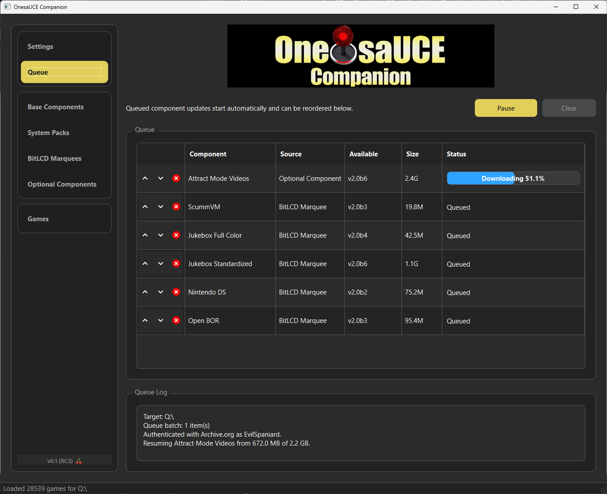
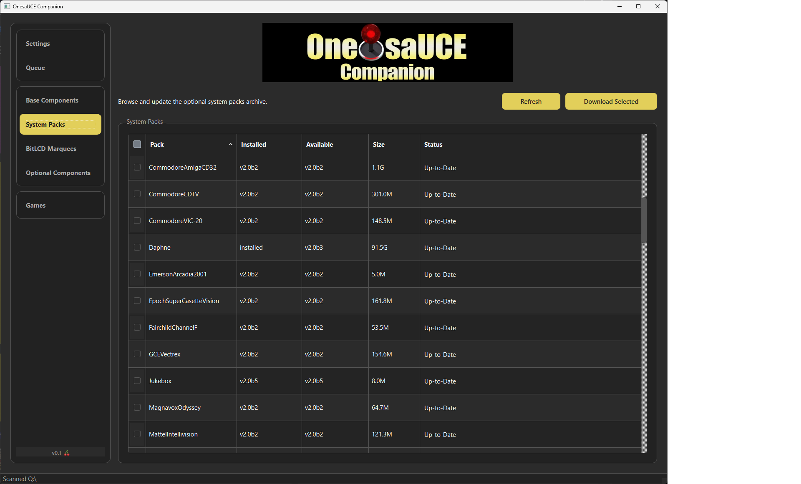
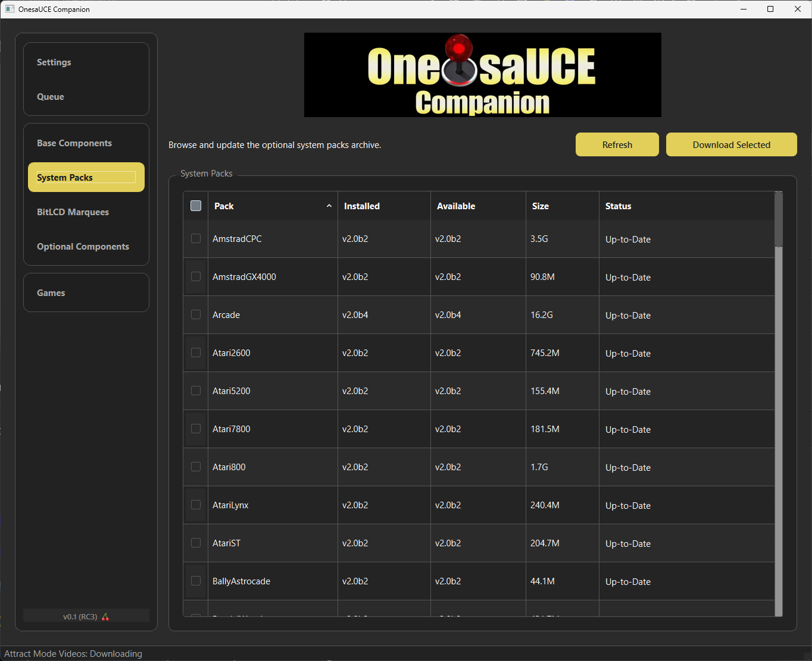
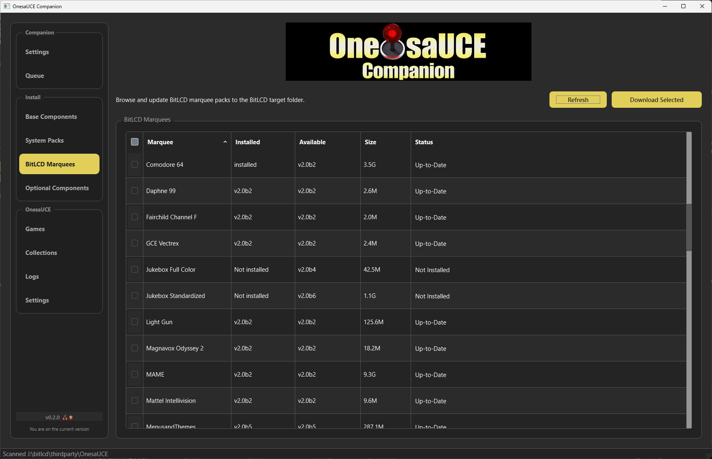
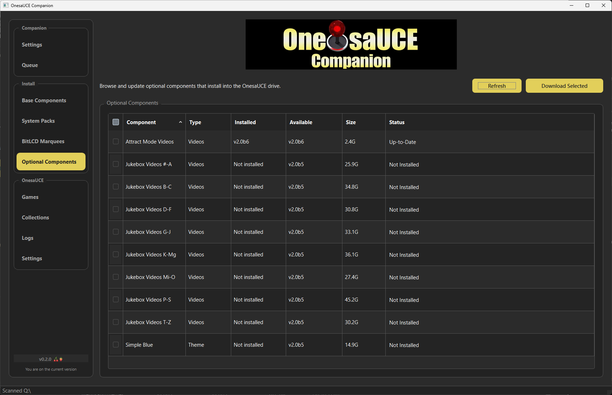
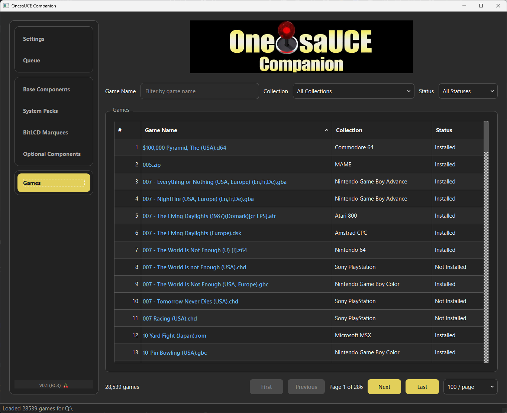
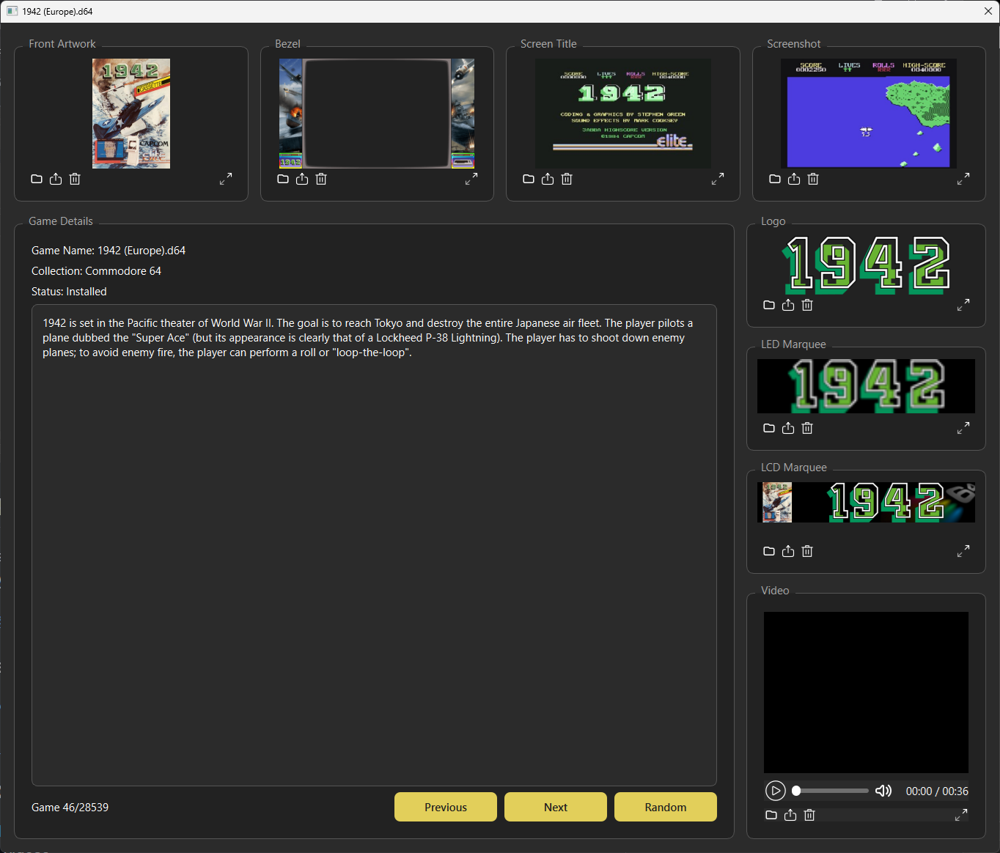

# OnesaUCE Companion

OnesaUCE Companion is a desktop utility for installing, updating, and managing OnesaUCE content for AtGames Legends Ultimate and related setups.

The goal of the app is to make OnesaUCE easier to work with for non-technical users. Instead of manually downloading large archives, comparing versions, and extracting files to the correct drive structure, the app provides a guided interface for common OnesaUCE maintenance tasks.

## What It Does

OnesaUCE Companion currently supports:

- installing and updating required base components
- browsing and downloading optional system packs
- browsing and downloading BitLCD marquee packs
- browsing and downloading optional components such as themes and video packs
- queueing multiple component downloads in a specific order
- resumable downloads and configurable download retention
- automatic version detection for many installed components
- backup support for changed files during installs
- a searchable Games browser built from the installed OnesaUCE catalog
- a Game Details screen for viewing story and media assets for installed games

## Settings

### OnesaUCE Target Folder
OnesaUCE can be installed one of the following ways
-  To a folder on a hard drive in your PC for backups or browsing media
-  To a blank NTFS formatted USB drive to use on your AtGames Legends device
-  To your existing OnesaUCE 2.0 USB drive, for performing updates or adding additional components

Note:   OnesaUCE 1.x based drives are not supported.   There is no clean upgrade path from 1.x to 2.0, so your best option is to wipe and reinstall, or use a different drive if you want to keep your original 1.x

### BitLCD Target Folder

The BitLCD is a separate accessory for the AtGames Legends Ultimate series of products allowing the user to display marquee images based on what game is currently selected in OnesaUCE.    It uses a removable flash drive for the storage of BitLCD marquee images.    You can use OnesaUCE Companion to manage the image sets installed to the drive.

BitLCD Marquee components can be installed one of the following ways
-  To a folder on a hard drive in your PC for backups or browsing marquee art.
-  To a blank FAT32 formatted USB drive, for use in your BitLCD device.
-  To an existing BitLCD USB drive for adding or updating Marquee packs.

Note:   For marquees to be seen by the BitLCD device, they need to be installed somewhere within the bitlcd/thirdparty folder.   It's recommended to create a bitlcd/thirdparty/onesauce folder and use that as your target folder.    Each marquee pack will install to it's own subfolder within the target folder.   

The OnesaUCE and BitLCD Target Folders must reside on, or be plugged into your PC.    Installing to network drives has not been tested.    Companion does not connect remotely to any AtGames legends devices.

### Archive.org Credentials

OnesauCE downloads are hosted by the Internet Archive.    Because these are larger downloads, it does require users to be authenticated in order to access the downloads.     You can specify your email and password and specify a max number of parallel downloads.

### Downloads

All downloads are installed to the location specified by your Target Folder and/or BitLCD Folder.    Companion needs to download the files before they are installed, so this section is where you will specify a downloads folder.   It's not recommended that you use your OnesaUCE drive for this storage, but it is possible.

You can also specify a retention policy for your downloads.    Your options are:

* Keep the latest version of each downloaded component
* Delete after every install (for minimal space usage)
* Keep zips up to a number of days
* Keep zips up to a max amount of space in GB


## Queue

The Queue allows you to manage the downloads of multiple components.    Each component in the queue will be listed along with the status of the download/install.    You can reorder items in the Queue to increase their relative priority in the download order.

Note that although you can download multiple components at once, only one gets installed at a time, so you will see this as a likely bottleneck when downloading many components at once.

The Queue can be paused and restarted as needed.     The Queue is preserved when exiting Companion.



## Base Components

The Base Components screen displays core OnesaUCE components.    These are all required in order to have a functional OnesaUCE installation.    

OnesaUCE Companion tracks which versions of components you have installed, and will check if newer versions are available.     If a component is missing or has an available update, then you can select that component to be added to the Queue for download and installation.



## System Packs

The System screen displays System Packs for computers, consoles, handhelds, and other systems supported by OnesaUCE.    



### BitLCD Marquees

The BitLCD screen displays marquee packs for various systems supported by OnesaUCE.



### Optional Components

The Optional Component screen includes optional components including Themes, Attract Videos, and Jukebox videos.



### Games

Browse indexed games from installed content, filter and sort the catalog, and inspect media/details for a specific title.





## Requirements

- Windows is the primary target environment for the current release
- Python 3.11 or newer when running from source
- Archive.org credentials for downloads that require authentication
- A valid OnesaUCE target folder for installs and updates
- (Optional)  A valid BitLCD target folder for installs and updates

## Run from Binary

* Download the latest zip file from the Releases page
* Unzip the zip file into a folder of your choice on your PC.
* Launch the OnesaUCECompanion.exe executable

Notes:   
* The .onesauce_companion folder is expected to be found in the same folder as the OnesaUCECompanion.exe, and is required for Companion to run. 
* Therefore it's recommended you not unzip this anywhere under your Program Files or other system protected folders.
* The executable is for Windows x64 (64-bit) only.

## Run From Source

From the repo root:

```powershell
python -m pip install -e .
onesauce-companion
```

You can also launch directly from the repo root with:

```powershell
.\run.ps1
```

or:

```bat
run.bat
```

Note:   This is a Python application but has not been tested with any Linux distribution or Apple devices.

## Build Windows EXE

From the repo root:

```powershell
.\build_exe.ps1
```

Build output:

```text
dist\OnesaUCECompanion\OnesaUCECompanion.exe
```

Keep the full `dist\OnesaUCECompanion` folder together when distributing the EXE.


## Licensing And Notices

This project is released under the GNU Affero General Public License v3.0.

See:
- [LICENSE](LICENSE)
- [THIRD_PARTY_NOTICES.md](THIRD_PARTY_NOTICES.md)
- [licenses/](licenses)

When publishing a binary release, make sure the release points to the corresponding public source tag or commit in this repository:
- https://github.com/ennisj/onesauce_companion


## Project Status

Current version: `v0.1.1`

Bugfix -  Failing to detect latest Arcade System Pack

## Roadmap

Initially the focus will be on bugfixes, then moving on to new features.
